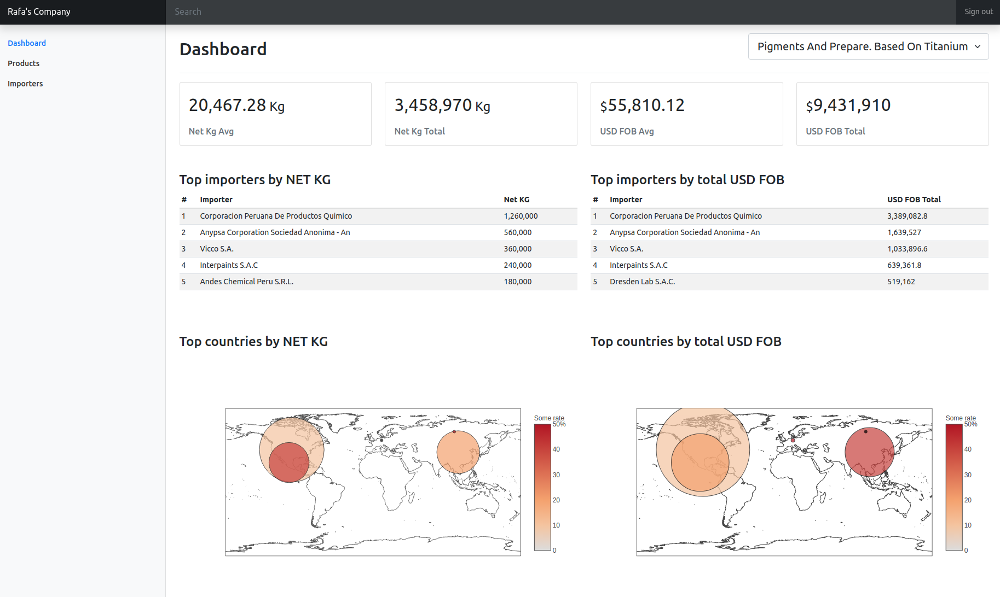

# Visualize Me

## Setup
### Database
- Create postgres database named `custom_analysis_db`
- Execute schema file in db/schema.sql

### ETL
- Add data extracted from veritrade to file `Resources/data.xlsx`
- Execute python notebook `etl_visualizme_cap.ipynb` to load transformed data to postgres DB

## Requiremens
### Python libs
- psycopg2
- pycountry
- sqlalchemy
- pandas
- flask
- flask_cors
